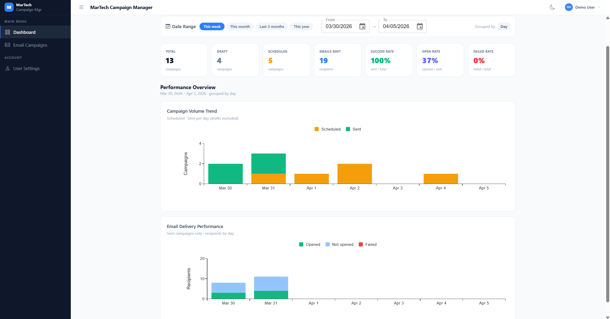
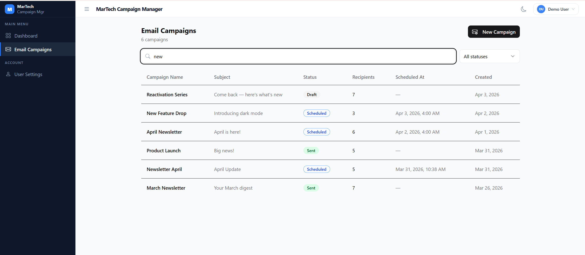
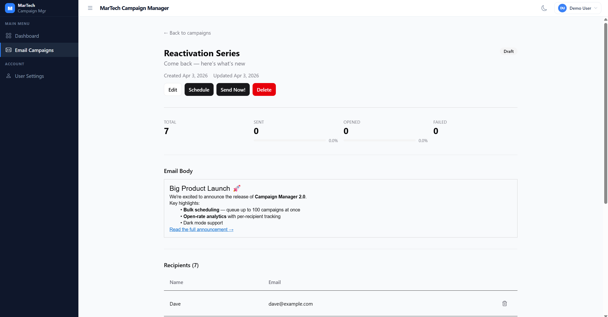

# Mini Campaign Manager

Mini Campaign Manager is a small full-stack MarTech app to create, schedule, send, and track email campaigns.

## Basic Functionality

- Register and login with JWT authentication.
- Create and manage campaigns (`draft`, `scheduled`, `sent`).
- Add recipients to campaigns and track per-recipient send status.
- Schedule campaigns for future send, cancel schedule, or send immediately.
- View campaign-level stats (`total`, `sent`, `failed`, `opened`, `open_rate`, `send_rate`).

### Screenshots

> Dashboard with range filter, total KPI, Campaign Volume Trend for total emails, and Email Delivery Performance for Opened, Sent, Failed volume



> Campaign overview with quick search, filter



> Campaign creation/edit flow with scheduling controls.
> Campaign detail page showing recipients and delivery stats.



## Basic Architecture

- **Monorepo** managed by **npm workspaces**, with two packages:
  - Backend - `packages/api`: Express + TypeScript + Knex + PostgreSQL + Zod + JWT.
  - Frontend - `packages/web`: React + Vite + TypeScript + Redux Toolkit + RTK Query + shadcn/ui.
- Infra: Docker Compose (`postgres`, `api`, `web`).

Architecture references:

- Backend architecture: [`packages/api/ARCHITECTURE.md`](packages/api/ARCHITECTURE.md)
- Frontend architecture: [`packages/web/ARCHITECTURE.md`](packages/web/ARCHITECTURE.md)

## Environment Setup

Prerequisites:

- Node.js 22+
- npm 10+
- Docker + Docker Compose

Install dependencies from repository root:

```bash
npm install
```

## Run the App

Start all services:

```bash
docker compose up --build
```

Service URLs:

- Web: [http://localhost:5173](http://localhost:5173)
- API: [http://localhost:3000](http://localhost:3000)
- Swagger: [http://localhost:3000/api-docs](http://localhost:3000/api-docs)

## Migrations and Seed

Run migration manually:

```bash
npm run migrate
```

Run seed manually:

```bash
npm run seed --workspace=packages/api
```

Compose-based startup behavior:

- `docker compose up` runs initial migration through `api-init`.
- Seed is optional and disabled by default.
- Enable seed during compose startup with:

```bash
RUN_SEED=true docker compose up --build
```

The demo seed uses the following data:

- 1 user: `demo@example.com` with password `password123`
- 23 campaigns: With different statuses and recipients
- 10 recipients: With different emails and names

## Tests

Backend unit tests (Vitest):

```bash
npm test
```

Backend integration tests (Vitest + Testcontainers):

```bash
npm run test:integration
```

Notes:

- Unit tests cover isolated business logic and helper behavior in the backend.
- Integration tests spin up real infrastructure with Testcontainers to validate API and database behavior together.

## How I Used Claude Code

I used Claude Code as an implementation assistant, while keeping architecture decisions and quality gates under manual review.

1. Started from the challenge requirement in [`.context/requirement.md`](.context/requirement.md), researched required technologies, and wrote an initial planning prompt in [`.context/prompts/plan.md`](.context/prompts/plan.md) with architecture decisions and additional implementation rules.
2. Broke execution into incremental steps using [`.context/tasks.md`](.context/tasks.md), then instructed the agent to implement or adjust each step as needed.
3. Implemented step-by-step, reviewed output after each step, and added manual validation where automation was not enough.
4. During Step 4 (Backend Implementation) and Step 8 (Frontend Implementation), I iteratively reviewed best practices and requested targeted refactors until the code reached a cleaner, domain-focused architecture.

### Agent Skills Usage

I explicitly used the skill workflow listed in [`.context/tasks.md`](.context/tasks.md), including:

- `brainstorming` and `writing-plans` for planning and decomposition.
- `test-driven-development` / `tdd` for test-first implementation flow.
- `dispatching-parallel-agents` and `subagent-driven-development` for independent work streams.
- `systematic-debugging` and `verification-before-completion` for failure handling and completion checks.
- `requesting-code-review` before finalizing major implementation steps.

### Spec-Driven Development (SDD)

The implementation followed an SDD process:

- Requirements source: [`.context/requirement.md`](.context/requirement.md)
- Project context and constraints: [`.context/constitutions.md`](.context/constitutions.md)
- Detailed execution plan: [`.context/tasks.md`](.context/tasks.md)
- Derived specs (API contracts, validation, business rules, screens): [`.context/spec/`](.context/spec/)

Code changes were accepted only when they aligned with these documents.

### Test-Driven Development (TDD)

For core business behavior, I followed a test-first approach:

- Wrote critical tests first (status guards, scheduling validation, stats formula, auth/JWT, validation contracts).
- Implemented code to satisfy failing tests afterward.
- Kept unit and integration tests as separate layers to validate both domain logic and end-to-end behavior.

### Continuous Context Improvement

Throughout implementation, I continuously updated project guidance documents whenever patterns changed:

- `CLAUDE.md` for working rules and agent guidance.
- `.context/constitutions.md` for conventions and architecture summaries.
- `packages/api/ARCHITECTURE.md` and `packages/web/ARCHITECTURE.md` for package-specific architecture rules.

This kept agent context accurate as the codebase evolved and reduced drift between implementation and documentation.

### Example Prompts I Used

- Initial prompt: [`.context/prompts/plan.md`](.context/prompts/plan.md)
- Backend refactor prompt:

```text
refactor backend to use class type and dto classes, split the schema into different classes contain the Dto class and its validator schema
example of the class way:
/**
 * Base validator class
 */
abstract class BaseValidator<T> {
  protected abstract schema: ZodSchema<T>;

  validate(req: Request, res: Response, next: NextFunction) {
    const result = this.schema.safeParse(req.body);

    if (!result.success) {
      return res.status(400).json({
        message: \"Validation failed\",
        errors: result.error.flatten(),
      });
    }

    // attach validated data
    req.body = result.data;
    next();
  }
}

/**
 * DTO type
 */
type CreateUserDto = {
  name: string;
  email: string;
  age?: number;
};
<...>

add the rule to prefer using classes into the constitutions.md file
```

```text
now make the refactor to split the work into layers:
- services will introduce classes for all logic and db handling. 
- controller should only handle the validation and capture the error from service class
* also write that improvement into the constitutions.md
create the ARCHITECTURE.md about what packages do (currently only for BE) and tell the CLAUDE.md to follow that architecture and convention
```

- Frontend refactor prompt:

```text
refactor all pages to:
- split the helper functions to package: helpers to helpers/<helpper-type>.ts
- split the large component (identified by section comments) and sub component into components/<name of the domain>/<component-name>.tsx
- split the validation into validations/<domain>.ts
make sure you update the ARCHITECTURE.md the frontend architecture and the package rule, update the constitutions.md about the instruction to follow when edit frontend code
```


### Where Claude Code Needed Correction

- Some generated code mixed responsibilities between layers (especially UI/state concerns), so I requested stricter separation and refactoring.
- I had to ask for tighter alignment with existing architecture rules and naming conventions in multiple iterations.
- A few generated implementations required explicit constraints (no speculative changes outside the current task scope).

### What I Would Not Delegate Fully

- Final architecture decisions and layer boundaries.
- Business-rule interpretation when requirements are ambiguous.
- Final QA sign-off (manual behavior checks and review before completion).
